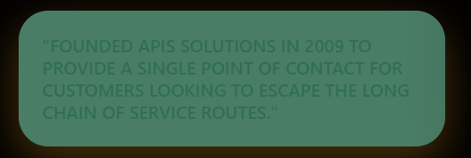

## Product Requirements Document (PRD): Home Page Enhancement & Feature Integration

**Project Name:** [Project Name] – Home Page Transformation  
**Status:** Draft  
**Stakeholders:** Engineering, Design, Product Management  

---

## 1. Executive Summary
The goal of this update is to transform the existing Home Page into a comprehensive "Hub" that synthesizes data from the **Services**, **Rentals**, and **Sales** modules. Instead of acting as a simple gateway, the Home Page will now surface critical data and high-value features directly to the user to increase engagement and reduce the time to conversion.

## 2. Goals & Objectives
* **Centralization:** Bring core functionality from sub-pages (Rental/Sales/Services) to the front.
* **Enhanced Utility:** Provide users with immediate "at-a-glance" data without requiring navigation.
* **UI/UX Modernization:** Maintain a high-fidelity, interactive design (Glassmorphism/Dark Mode) while managing denser information.

---

## 3. Targeted Feature Enhancements

### 3.1. Unified Search & Filter Header
* **Requirement:** A global search bar that allows users to toggle between "Sales," "Rentals," or "Services."
* **Data Points:** Location, Category, and Price Range.

### 3.2. "Live Market" Data Strips (Sales & Rentals)
* **Requirement:** Pull real-time or featured data from the Sales and Rental databases to show on the Home Page.
* **Functional Specs:**
    * **Trending Sales:** Horizontal scroll of the top 3 most-viewed sale listings.
    * **Instant Rentals:** A "Quick View" card for rentals available within a 24-hour window.
    * **Key Data:** Image, Price, Location, and a "View Details" CTA.

### 3.3. Service Integration Module
* **Requirement:** An interactive grid showcasing the primary services offered.
* **Data Points:** Service name, average rating, and "Next Available Slot" or "Starting Price."
* **Action:** A "Book Now" button that triggers a modal or direct redirect to the Service checkout.

### 3.4. Dynamic Dashboard / Activity Feed
* **Requirement:** A section for logged-in users showing their recent activity or personalized recommendations based on previous searches in Sales/Rentals.

---

## 4. Technical Requirements

### 4.1. Architecture & Performance
* **Frontend:** Implement responsive, high-performance cards using **React.js**. Utilize glassmorphism effects (`backdrop-blur-md`) for the new data containers.
* **Backend:** Optimize **Node.js** controllers to handle concurrent fetching of Sales, Rentals, and Services data to ensure the Home Page load time remains under 2 seconds.
* **Database:** Utilize **Prisma** for efficient relational queries and **MongoDB** aggregation to pipe "Trending" or "Recently Added" data to the home screen.

### 4.2. API Integration
* Develop a consolidated `/api/home/v2` endpoint that returns a paginated summary of all three domains (Sales, Rentals, Services) to minimize redundant network requests.

---

## 5. Design & UI Specifications
* **Theme:** Premium Dark Mode (Deep Navy/Black palette).
* **Components:** * **Bento-style Grid:** Use a Bento layout to organize different data types (e.g., a large card for Featured Sales, smaller cards for Service links).
    * **Micro-interactions:** Hover effects on Sales/Rental cards showing "Quick Specs" (e.g., square footage or service duration).

---

## 6. Success Metrics
* **Reduced Bounce Rate:** Users should find relevant data on the Home Page faster.
* **Increased Click-Through Rate (CTR):** Measured on the new "Direct Booking" and "Quick Sale View" buttons.
* **Reduced Navigation Depth:** Decrease in the average number of clicks required to reach a specific Rental or Sale item.

